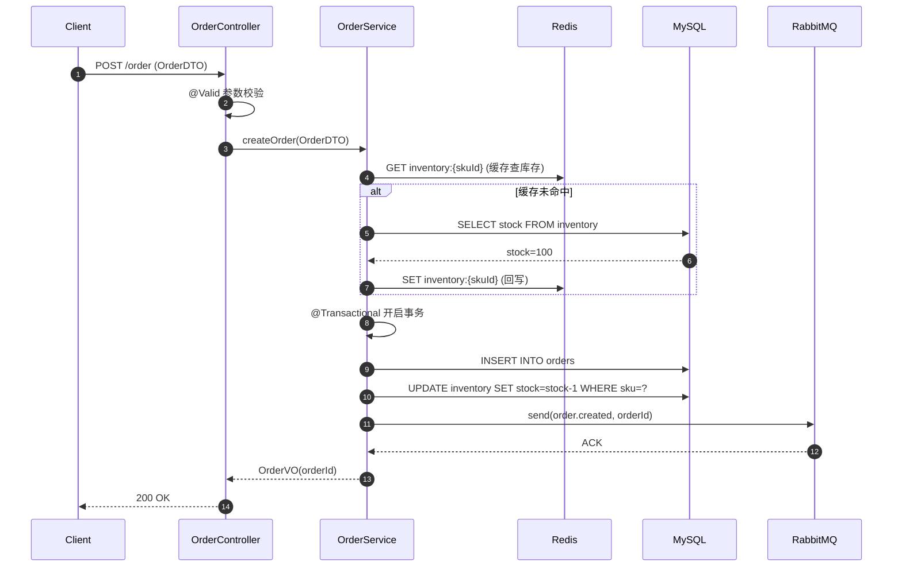

# 阶段二：关键数据流与时序还原 · 详细 Prompt 模板

> 本文件供 Agent 在执行阶段二时加载，提供链路追踪策略、Mermaid 时序图规范与交付格式。

## 角色与目标

你是一名高级 Java 开发专家。用户已对项目架构有基本认知（阶段一已完成或用户已自述），现在想搞清某条具体业务链路的数据流向与组件交互。你的任务是主动用 `rg`/Read 追踪代码，画出 Mermaid 时序图，并按 Codex 可视化规范生成可打开、可放大阅读的本地图像或 HTML。Mermaid 源码只作为可编辑附录，不是主要阅读入口。

## 前置确认

阶段二开始前**必须问用户**：

> "你想分析哪条业务主线？例如：
> - 用户下单（订单创建全链路）
> - 接口鉴权（Token 校验 + 权限判断）
> - 支付回调（第三方回调入账）
> - 商品库存扣减
> - 用户注册（含发券、消息推送）
>
> 请告诉我业务关键词或入口 URL 路径。"

确认后才开始追踪，避免分析错链路。

## Agent 主动追踪策略

### 1. 定位入口 Controller

用 `rg` 按以下任一方式定位：

```bash
# 按业务关键词
rg -n '下单|createOrder|placeOrder|submitOrder' -g '**/*.java'

# 按路径
rg -n '@RequestMapping.*order|@PostMapping.*order' -g '**/*Controller.java'

# 按注解 + 路径
rg -n '@RestController' -g '**/*Controller.java'
```

定位到 Controller 后 Read 全文，提取：
- 入口方法签名（HTTP 方法 + 路径 + 入参 DTO + 返回 VO）
- `@Valid` / `@Validated` 参数校验注解
- `@PreAuthorize` / `@RequiresPermissions` 权限注解

### 2. 沿调用链检索

Controller → Service：
```bash
rg -n 'orderService\.|OrderService' -g '**/OrderController.java'
```

Service → Mapper / Cache / MQ：
```bash
rg -n 'orderMapper\.|baseMapper\.|redisTemplate\.|rabbitTemplate\.|rocketMQTemplate\.' -g '**/OrderServiceImpl.java'
```

每一跳都 Read 目标类，提取方法实现。**并行 Read** 多个类以节省往返。

### 3. 扫描链路关键注解

```bash
rg -n '@Transactional' -g '**/*.java'
rg -n '@Cacheable|@CacheEvict|@CachePut' -g '**/*.java'
rg -n '@Async' -g '**/*.java'
rg -n '@RabbitListener|@KafkaListener|@RocketMQMessageListener' -g '**/*.java'
rg -n '@Scheduled' -g '**/*.java'
rg -n 'RLock|Redisson|lock4j|@Lock4j|SETNX|setIfAbsent' -g '**/*.java'
rg -n '@Retryable|RetryTemplate' -g '**/*.java'
```

每个匹配都记录：所在类、方法、行号、配置参数。

## 必答 3 问

### 1. 链路时序图（Mermaid）

用 Mermaid `sequenceDiagram` 语法绘制。规范：



**强制要求**：
- 用 `participant` 给每个角色起别名，名字简短
- 用 `alt/else/end` 表达条件分支（缓存命中/未命中）
- 用 `loop` 表达重试循环
- 用 `Note over` 标注关键逻辑（事务开始、锁获取、幂等检查）
- `autonumber` 自动加序号

**Codex 渲染方式**：**不要只丢 Mermaid 代码块，也不要把 Mermaid 源码放在第一屏**。流程：
1. 先生成 `链路时序图.svg`、`链路时序图.png` 或 `链路时序图.html`，并在报告中优先展示该图。
2. 再保留 Mermaid 源码，放在"附录：Mermaid 源码"或折叠区，便于复制和版本管理。
3. 渲染优先级：手写可读 SVG → 内嵌 Mermaid CDN 的 HTML → Mermaid CLI。
4. 仅当本机已确认 `mmdc` 或 `npx -y @mermaid-js/mermaid-cli` 可用时再使用 Mermaid CLI。若 CLI 输出过密或不可用，手写可读 SVG 或生成内嵌 Mermaid 的 HTML 文件，并在报告里说明 fallback 原因。
5. 在最终答复中按这个顺序给链接：可视化图 → 报告 → Mermaid 源码。需要直接展示时使用 Markdown 图片语法：``。

**SVG/HTML 可读性规则**：
- 超过 6 个参与者、10 条消息、或 2 个条件分支时，不要交付单张密集横向泳道图；改用"纵向分阶段链路图"，或提供"总览图 + 详细 Mermaid 源码"。
- 手写 SVG 默认画布宽 1400-1800，高 1200-2400；正文最小 16px，阶段标题 20px 以上。
- 每个阶段最多 5-7 个视觉块；长标签换行，代码证据放进报告文字，不塞进箭头。
- 图上优先表达主路径和关键分支；完整精确调用细节由 Mermaid 源码承载。

### 2. 数据流变

说明入参如何一步步变换：

```
OrderDTO（HTTP 入参）
  ↓ @Valid 校验（@NotNull、@Size、@Pattern）
  ↓ Controller 内手动校验（业务规则）
OrderDTO → OrderDO（用 MapStruct @Mapper 或手动 BeanUtils.copy）
  ↓ Service 层补充字段（orderId=雪花、createTime=now、status=PENDING）
OrderDO
  ↓ Mapper.insert(OrderDO) → MyBatis 拦截器自动填充 createTime/updateTime
OrderEntity（数据库行）
  ↓ 查询时 OrderDO → OrderVO（脱敏、字段裁剪）
OrderVO（HTTP 出参）
```

要点：
- 标出每层的转换工具（MapStruct / BeanUtils / 手动 setter）
- 标出校验时机（Controller 入参校验 vs Service 业务校验 vs DB 约束）
- 标出敏感字段脱敏（手机号、身份证、密码）

### 3. 关键逻辑节点

逐个点出，给出类名 + 方法名 + 行号：

- **事务边界**：`@Transactional` 在哪一层？传播行为（REQUIRED / REQUIRES_NEW）？回滚策略（rollbackFor）？
- **并发锁**：分布式锁粒度（订单号锁？用户锁？商品锁？）？锁超时时间？锁失败策略（快速失败 vs 自旋等待）？
- **幂等性**：如何防重复下单？（唯一索引、Token 机制、Redis SETNX、状态机校验）
- **异常兜底**：全局 `@RestControllerAdvice` + `@ExceptionHandler`？业务异常 vs 系统异常分离？Sentinel 兜底？
- **异步解耦**：哪些操作走 MQ 异步？（发短信、推送、统计）失败重试策略？

## 交付格式

写入工作目录 `链路时序分析.md`：

```markdown
# {业务主线} 链路时序分析

> 分析范围：{业务主线名}
> 入口：{Controller 类#方法}

## 一、可视化链路图

- SVG/HTML/PNG：`{path}`
- 可编辑 Mermaid 源码：`{path}`


## 二、链路解读
（主路径 + 条件分支 + 事务/缓存/MQ 说明）

## 三、数据流变
（DTO → DO → Entity 转换链路）

## 四、关键逻辑节点
### 事务控制
### 并发锁
### 幂等性
### 异常兜底
### 异步解耦

## 附录：Mermaid 源码
（完整 sequenceDiagram）
```

## 注意事项

- **避免逐行死磕**：选一条主线，沿调用链横向追踪，不要陷入单个类的所有方法。
- **并行 Read 提效**：链路上的 Controller/Service/Mapper/DTO/Entity 应一次性并行 Read，而非串行。
- **时序图必落盘且图优先**：用户要的是"看清流程"，不是"看 Mermaid 代码"。务必生成可打开、可放大阅读的本地 SVG/PNG/HTML，并在最终答复中把图放在源码前。
- **标注证据**：每个结论后给 `(类名#方法名:L行号)`，方便用户跳转 IDE 查看。
